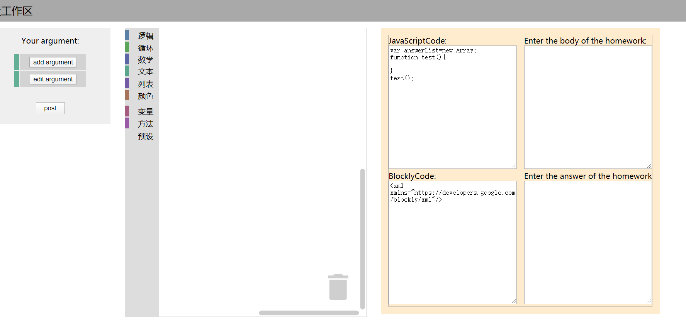
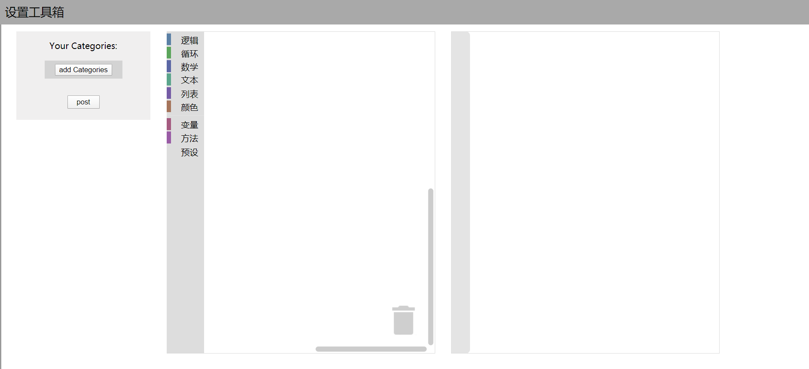
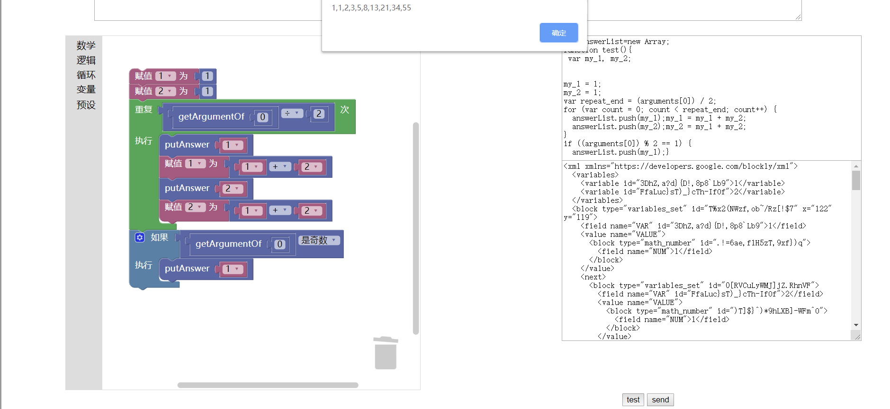

# hello-blockly
 使用blockly开发的，可视化编程教育系统

> Google's Blockly is a web-based, visual programming editor. Users can drag blocks together to build programs.

技术栈：

- [blockly](https://github.com/google/blockly)

- React

## 使用方法

- clone到本地
- `npm install`
- `npm start`

## 项目效果

教师端布置作业效果

教师自定义可使用的逻辑块

学生端做作业效果

